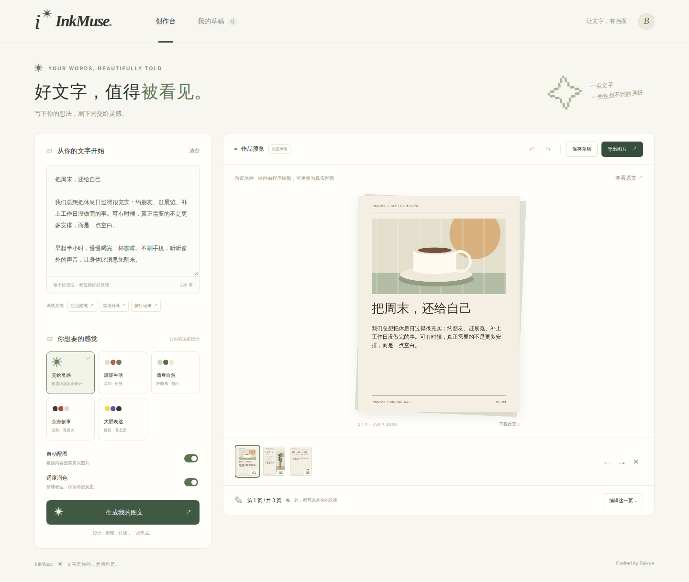

# InkMuse

**Your words, beautifully told.** By Baixue Wu.

InkMuse turns finished writing into editable visual stories. It interprets the content, designs a coordinated set of pages, finds matching imagery, and lets you revise individual pages before exporting.



## What works

- AI text polishing, page planning, content-aware palettes, typography and image proportions.
- Wikimedia image search with metadata-based candidate selection and retained attribution.
- Page-by-page text editing, alternate compositions, image replacement and upload.
- Automatic continuation pages when text exceeds the available space.
- Browser undo/redo, page reordering, local drafts, portable project files and high-resolution PNG/ZIP export.
- A native WeChat client using the same Canvas core, including editing, image search/upload, local draft storage and saving to the photo album.
- An image-generation adapter for a configured JSON HTTP endpoint. It is **not configured by default**; search and upload work independently.

## Run locally

Requires Node.js 22+, Python 3.10+, and an authenticated Claude CLI for live design generation.

```sh
npm ci
npm run build
claude auth login
npm start
```

Open **http://127.0.0.1:8791**. The built-in sample, editing and exporting work without a model request. Clicking Generate uses the configured model and, when enabled, online image search. Failed generation keeps your existing work and reports the error.

For a different service configuration:

```sh
python3 -m server --config config.local.json
python3 -m server --help
node scripts/build.cjs --help
```

Copy `config.example.json` to `config.local.json` before making local changes. Paths in that configuration resolve relative to the configuration file. Local configuration and cached user assets are ignored by Git. No environment-variable setup is required.

## WeChat mini program

```sh
node scripts/build.cjs --appid YOUR_APPID --api-base https://YOUR_SERVICE_DOMAIN
```

Import `dist/miniprogram` into WeChat DevTools. The default build uses a tourist AppID and a localhost service for development only. On a phone, localhost refers to the phone, so use a reachable service address. Configure the service HTTPS domain for requests and downloads, and the Wikimedia thumbnail domain used by search previews. DevTools may disable domain checks during local debugging; that does not make the app ready for publication.

The native client is implemented and build-checked, but **has not been verified in WeChat DevTools or on a physical device**. AppID, service hosting, domain registration, album permission behavior, and platform review remain deployment work. The current service is a local single-user prototype, not an authenticated multi-user public service. Do not expose it publicly without adding deployment authentication and usage limits.

## Optional image generation

Add `generation` to the private server configuration for an images-generation-compatible endpoint:

```json
{
  "generation": {
    "url": "https://YOUR_PROVIDER/images/generations",
    "api_key": "YOUR_PRIVATE_KEY",
    "model": "YOUR_IMAGE_MODEL",
    "size": "1024x1024",
    "timeout": 120
  }
}
```

The adapter sends `model`, `prompt`, `n: 1`, `size`, and `response_format: "b64_json"`, and expects `data[0].b64_json`. Check your provider's supported contract. Generated images are labelled as generated. This adapter has fixture-based contract tests; no live paid image service was configured during initial development.

## Editing and export

Use **编辑这一页** to change copy, composition, or imagery. Long copy continues onto additional pages instead of being truncated. A style change retains the text and images; a new generation creates a new interpretation and can be undone in the browser.

**导出图片** produces a ZIP containing 1500 × 2000 PNGs, image attribution, and a portable JSON document with embedded images. Import that document through **我的草稿** to continue editing. Browser drafts are stored only in that browser. Native drafts are stored on that device. Exported images are not automatically posted to a social platform.

Image search returns candidates, not a guarantee of factual correspondence. Inspect imagery before publishing and retain the accompanying source and license information. Metadata selection does not inspect image pixels. The built-in sample uses original procedural illustrations and is labelled as a sample.

## Verify

```sh
npm test
npm run build
npm run test:browser
python3 scripts/smoke.py --url http://127.0.0.1:8791 --out .local/live-design.json
node scripts/preview.cjs --url http://127.0.0.1:8791 --out .local/preview --live
```

The last two commands make real model/search requests. Browser tests cover editing, undo, order changes, drafts, PNG dimensions, ZIP contents, image replacement, mobile layout, and recoverable service failures. Tests with mocked provider responses are separate from live smoke results.

See [validation and remaining platform checks](docs/validation.md) for the verified scope.

## Structure

| Directory | Responsibility |
| --- | --- |
| `core/` | Portable document model, measured pagination and Canvas rendering |
| `server/` | Explicitly configured model and image adapters, asset cache, HTTP service |
| `web/` | Browser creation and review client |
| `miniprogram/` | Native WeChat client |
| `scripts/` | Reproducible build and live verification commands |
| `tests/` | Core, provider, HTTP and browser tests |

Moka is a reference for the editable-design workflow. This implementation does not copy its source. See [references](REFERENCES.md) and [design decisions](design-decisions.md).
